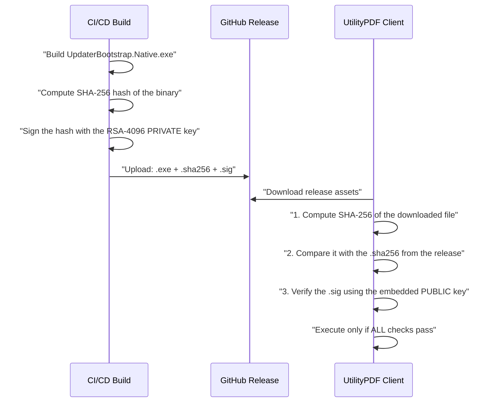

```mermaid
sequenceDiagram
    participant CI as CI/CD Build
    participant GH as GitHub Release
    participant App as UtilityPDF Client

    CI->>CI: "Build UpdaterBootstrap.Native.exe"
    CI->>CI: "Compute SHA-256 hash of the binary"
    CI->>CI: "Sign the hash with the RSA‑4096 PRIVATE key"
    CI->>GH: "Upload: .exe + .sha256 + .sig"
    App->>GH: "Download release assets"
    App->>App: "1. Compute SHA‑256 of the downloaded file"
    App->>App: "2. Compare it with the .sha256 from the release"
    App->>App: "3. Verify the .sig using the embedded PUBLIC key"
    App->>App: "Execute only if ALL checks pass"
```
