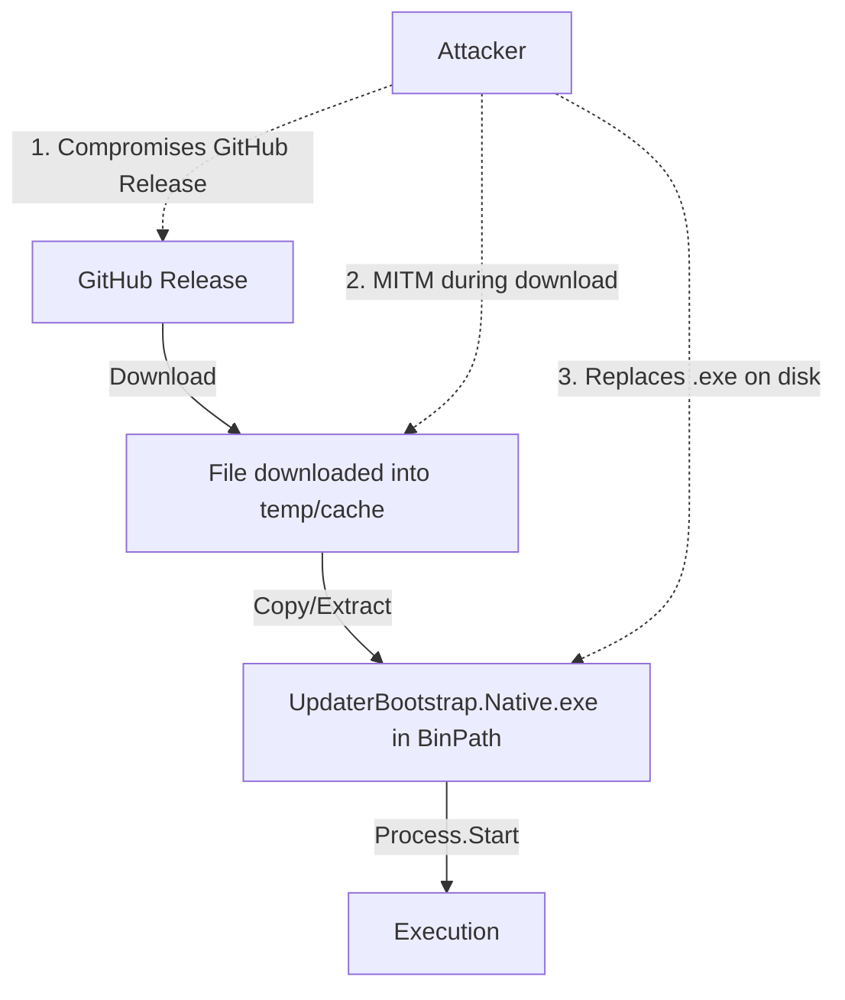

```mermaid
flowchart TD
    A["GitHub Release"] -->|"Download"| B["File downloaded into temp/cache"]
    B -->|"Copy/Extract"| C["UpdaterBootstrap.Native.exe in BinPath"]
    C -->|"Process.Start"| D["Execution"]

    E["Attacker"] -.->|"1. Compromises GitHub Release"| A
    E -.->|"2. MITM during download"| B
    E -.->|"3. Replaces .exe on disk"| C
```
