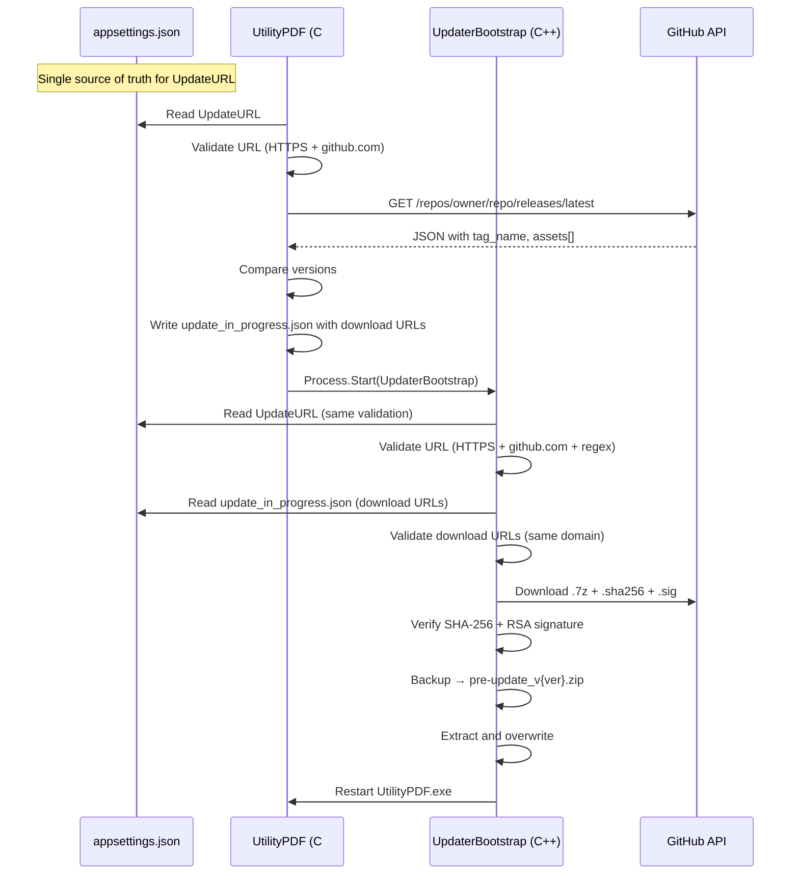

```mermaid
sequenceDiagram
	participant CFG as appsettings.json
	participant APP as UtilityPDF (C#)
	participant UPD as UpdaterBootstrap (C++)
	participant GH as GitHub API

	Note over CFG: Single source of truth for UpdateURL

	APP->>CFG: Read UpdateURL
	APP->>APP: Validate URL (HTTPS + github.com)
	APP->>GH: GET /repos/owner/repo/releases/latest
	GH-->>APP: JSON with tag_name, assets[]
	APP->>APP: Compare versions
	APP->>APP: Write update_in_progress.json with download URLs
	APP->>UPD: Process.Start(UpdaterBootstrap)

	UPD->>CFG: Read UpdateURL (same validation)
	UPD->>UPD: Validate URL (HTTPS + github.com + regex)
	UPD->>CFG: Read update_in_progress.json (download URLs)
	UPD->>UPD: Validate download URLs (same domain)
	UPD->>GH: Download .7z + .sha256 + .sig
	UPD->>UPD: Verify SHA-256 + RSA signature
	UPD->>UPD: Backup → pre-update_v{ver}.zip
	UPD->>UPD: Extract and overwrite
	UPD->>APP: Restart UtilityPDF.exe
```