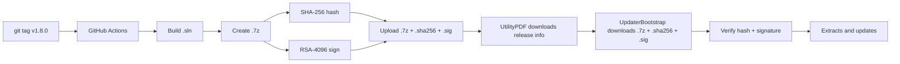

```mermaid
flowchart LR
A["git tag v1.8.0"] --> B["GitHub Actions"]
    B --> C["Build .sln"]
    C --> D["Create .7z"]
    D --> E["SHA-256 hash"]
    D --> F["RSA-4096 sign"]
    E --> G["Upload .7z + .sha256 + .sig"]
    F --> G
    G --> H["UtilityPDF downloads release info"]
    H --> I["UpdaterBootstrap downloads .7z + .sha256 + .sig"]
    I --> J["Verify hash + signature"]
    J --> K["Extracts and updates"]
```